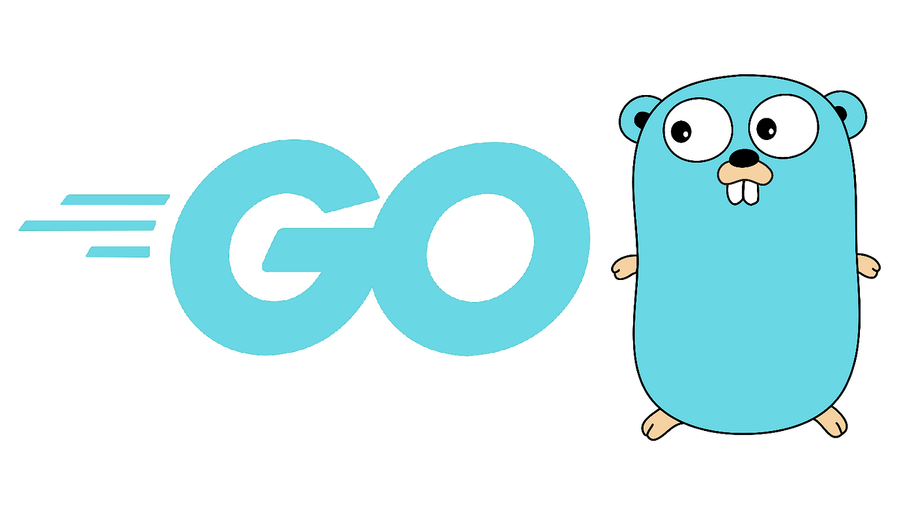

# Learning Golang

Hello! As I learn and explore the Go programming language, I would like to share my progress with you. I have organized my learnings into separate chapters, which cover a range of topics from foundational concepts such as variables and data structures, to more advanced topics like goroutines and concurrency. By sharing my learnings with you, I hope to help others who are also interested in learning Go, as well as solidify my own understanding of the language.

Here are the chapters:

1. [Go Commands for Efficient Development and Code Quality](go_commands.md)
    - List of mentioned commands
        - go run
        - go build
        - go install
        - go fmt
        - goimports
        - golint
        - go vet
        - golangci-lint

2. [Streamline Your Go Development with Makefiles](makefiles.md)
    - This text explains how to use Makefiles to automate the build process. Targets are defined in the Makefile with a name and a list of dependencies.

3. [Primitive Types and Variable Declaration in Go](primitive_types/primitive_types.md)
    - This chapter covers several concepts related to Go programming language, including the zero value, literals, and variable declaration. The zero value is a default value assigned to a variable that is declared but not assigned a value. There are four kinds of literals in Go, including integer literals, floating point literals, rune literals, and string literals. Variable declaration in Go can be done using the var keyword, and multiple variables can be declared at once using a declaration list. The := operator can also be used for short declaration format, which allows type inference. However, it has limitations when used at the package level.

4. [Composite Types and Data Structures in Go](composite_types/composite_types.md)
    - This chapter covers some concepts including slices, make function, maps, structs, and strings. Slices are dynamic arrays in Go, and we can simulate multidimensional slices by declaring a slice of slices. The Zero Value for slices is nil, and a slice isn't comparable. We can append to a slice using the built-in append function. The make function allows us to create an empty slice with a specified length and capacity. Maps are unordered collections of key-value pairs, and we can use the built-in make function to create maps. Structs are composite types that allow us to define our own types, and we can create an instance of a struct using the struct literal syntax. Strings are immutable sequences of bytes, and we can use various built-in functions to manipulate them, such as len, index, and substring.